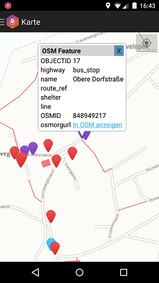

# **OSM-Geotrigger-App**
*Sample application with the Esri Geotrigger Service based on OpenStreetMap data*

This repository contains the source code for the OSM-Geotrigger-App, a sample Java and Android project to demonstrate the [Esri Geotrigger Service](https://developers.arcgis.com/en/features/geotrigger-service/).

For more information see GeoNet.

## **Features**
This project is divided into several sub projects:

* [OSM Geotrigger Android App](./Android/OsmTriggerApp)
* [OSM ArcGIS Loader](./Admin/OsmLib)
* [Geotrigger Core Library](./Admin/Core)
* [Geotrigger Administrator](./Admin/GUI)

## **Contributing**

You are welcome to checkout this sample code to get inspirated for your own projects.

## **Licensing**
Copyright 2015 Esri Deutschland GmbH

Licensed under the Apache License, Version 2.0 (the "License");
you may not use this file except in compliance with the License.
You may obtain a copy of the License at

   http://www.apache.org/licenses/LICENSE-2.0

Unless required by applicable law or agreed to in writing, software
distributed under the License is distributed on an "AS IS" BASIS,
WITHOUT WARRANTIES OR CONDITIONS OF ANY KIND, either express or implied.
See the License for the specific language governing permissions and
limitations under the License.

A copy of the license is available in the repository's LICENSE-2.0.txt file.
